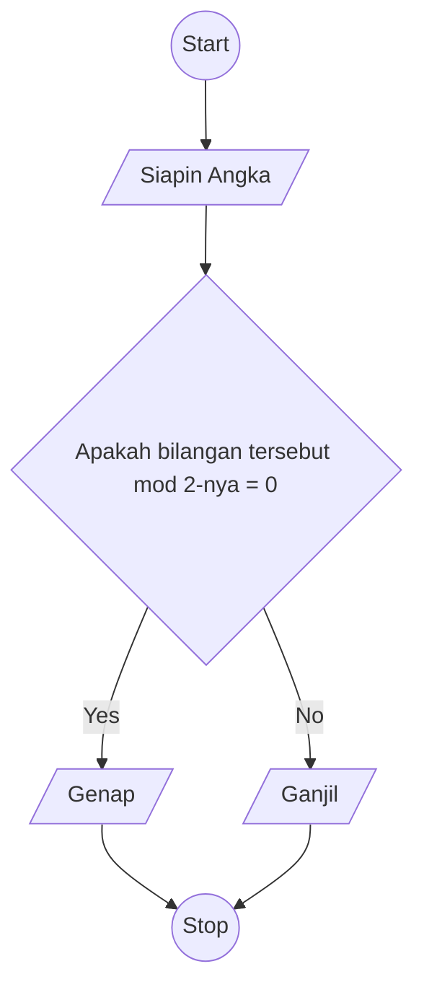

# Algoritma

## Algoritma Deskriptif

## Edisi Bilangan Ganjil Genap

```
  1. Mulai
  2. Siapkan sebuah angka
  3. Angka tersebut dibagi 2
  4. Apakah ada sisa dari hasil pembagian tersebut?
  5. Jika tidak, itu genap, jika iya itu ganjil
  6. Selesai
```

## Algoritma Flowchart


