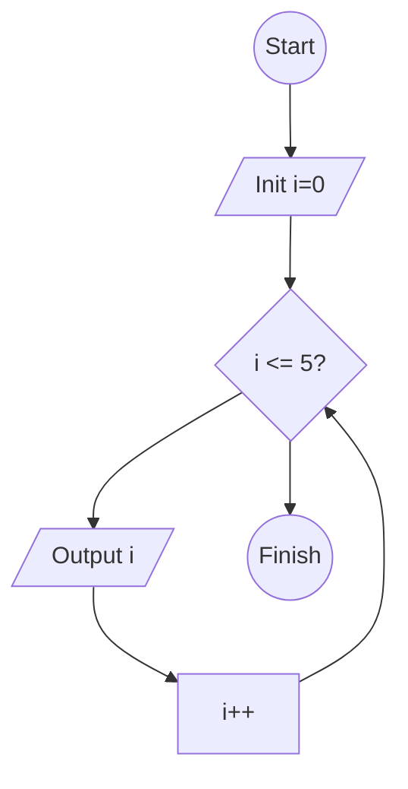
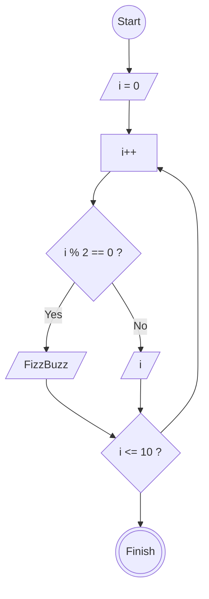

# Algoritma

## Looping

### Flowchart



## FizzBuzz - Setiap Angka Genap jadi FizzBuzz

### Pseudocode

```pseudocode
DECLARE Number: Integer
Number <- 0

REPEAT
  Number <- Number + 1
  IF Number MOD 2 = 0 THEN
    OUTPUT "FizzBuzz"
  ELSE
    OUTPUT Number
  ENDIF
UNTIL Number > 10
```


