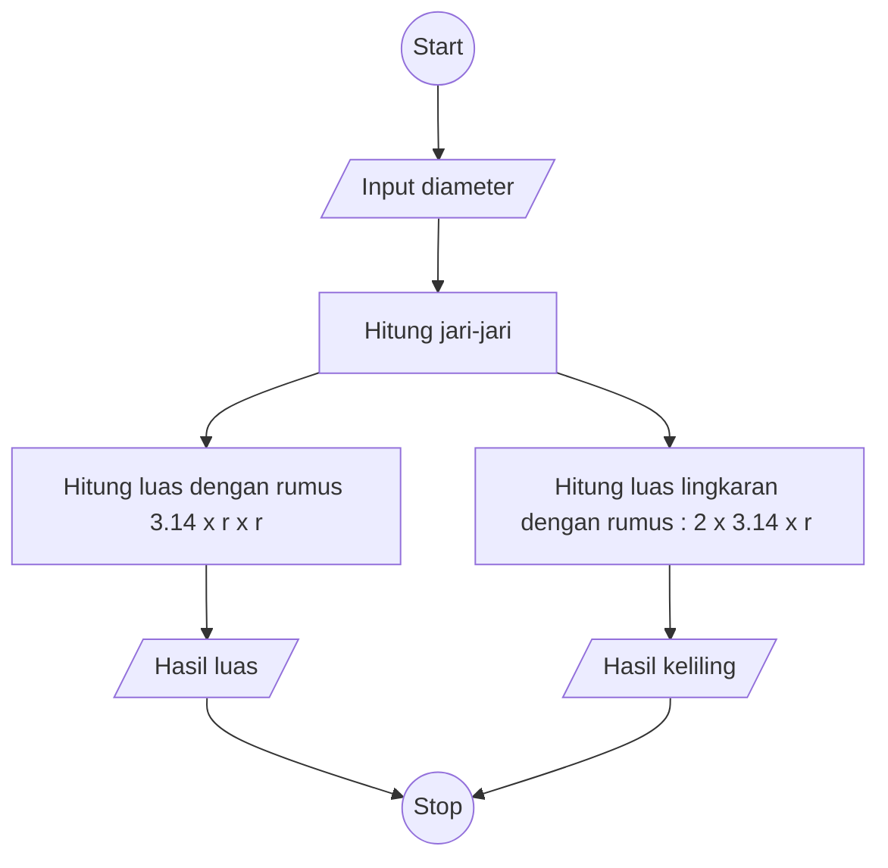

# Algoritma

## Edisi Luas dan Keliling Lingkaran

### Algoritma Deskriptif

```
  1. Mulai
  2. Siapkan sebuah lingkaran
  3. Cari jari-jarinya. Dengan cara membagi dua dari diameter lingkaran tersebut. Sebagai contoh jari-jarinya: 14cm
  4. Untuk dapatkan luas kita lakukan perhitungan dengan rumusan berikut
  5. 3.14 * 14 * 14 = 615.44
  6. Maka, luasan lingkaran tersebut adalah 615.44 cm persegi
  7. Untuk mendapatkan keliling lingkaran kita hitung dengan rumusan berikut:
  8. 2 * 3.14 * 14 = 87.92
  9. Maka, keliling lingkaran tersebut adalah 87.92 cm2
  10 Selesai

```

## Algoritma Flowchart


