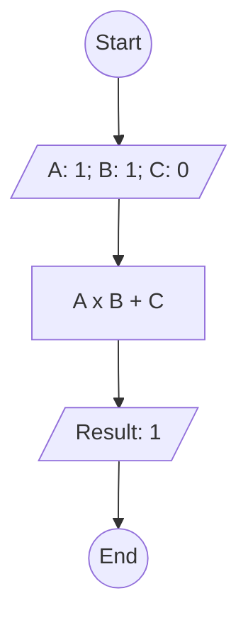

# Algoritma

## Perhitungan

### Algoritma Deskriptif

```
  1. Mulai
  2. Masukkan Angka Pertama : 1
  3. Masukkan Angka Kedua : 1
  4. Masukkan Angka Ketiga : 0
  4. Lakukan perhitungan berikut Angka Pertama dikali Angka Kedua Ditambah Angka Ketiga
  5. Tampilkan hasil perhitungan tersebut
  6. Selesai
```

### Algoritma Flowchart



### Algoritma Pseudo-Code

```pseudo-code
CONSTANT A: 1
CONSTANT B: 1
CONSTANT C: 0
DECLARE Result: INTEGER

Result <- A + B * C

Output "Hasil A + B * C", Result
```
